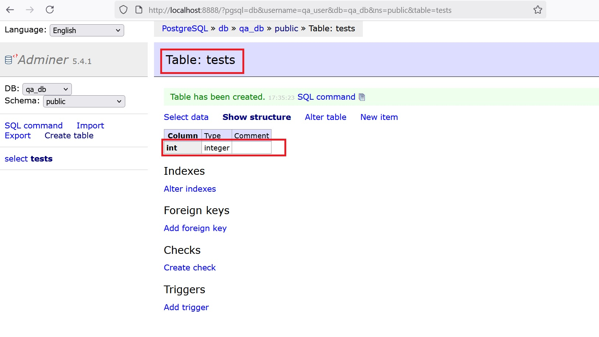

md

Comandat docker compose down -v opreste totul, sterge si containerele si volumul de date si reseteaza tot. 
Urmatoarele teste pot fi rulate pe un mediu curat, fara a avea rezultate “false positive” sau “bad data tests”.